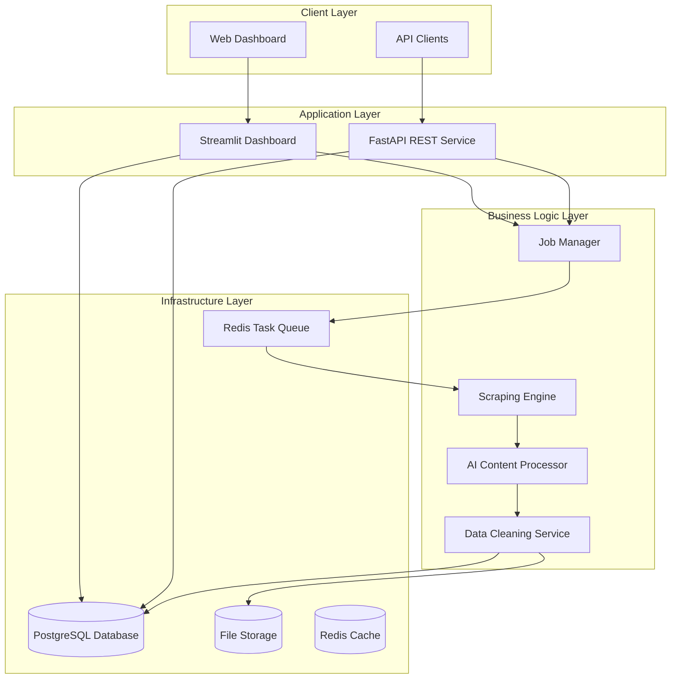

# Design Document

## Overview

The Intelligent Web Scraper is a full-stack Python application that combines web scraping, AI-powered content processing, real-time monitoring, and data access capabilities. The system follows a microservices-inspired architecture with clear separation of concerns, enabling scalability and maintainability.

The core architecture consists of:
- **Scraping Engine**: Selenium-based web scraping with dynamic content handling
- **AI Processing Pipeline**: Content analysis and intelligent data extraction
- **Data Storage Layer**: Persistent storage for scraped data and metadata
- **API Service**: RESTful endpoints for programmatic access
- **Dashboard Service**: Streamlit-based real-time monitoring interface
- **Task Queue System**: Asynchronous job processing and management

## Architecture



## Components and Interfaces

### 1. Scraping Engine (`scraper/`)

**Purpose**: Handles web scraping operations using Selenium WebDriver with support for dynamic content and anti-bot evasion.

**Key Classes**:
- `WebScraper`: Main scraping orchestrator
- `SeleniumDriver`: WebDriver wrapper with stealth capabilities
- `ContentExtractor`: HTML parsing and data extraction
- `ScrapingConfig`: Configuration management for scraping jobs

**Interfaces**:
```python
class WebScraperInterface:
    def scrape_url(self, url: str, config: ScrapingConfig) -> ScrapingResult
    def scrape_multiple(self, urls: List[str], config: ScrapingConfig) -> List[ScrapingResult]
    def handle_dynamic_content(self, driver: WebDriver, wait_conditions: List[str]) -> None
```

### 2. AI Content Processor (`ai_processor/`)

**Purpose**: Processes raw scraped content using AI models to extract structured data and provide intelligent parsing.

**Key Classes**:
- `ContentProcessor`: Main AI processing coordinator
- `TextAnalyzer`: Natural language processing for text content
- `StructureExtractor`: Identifies and extracts data structures
- `ConfidenceScorer`: Provides quality scores for extracted data

**Interfaces**:
```python
class AIProcessorInterface:
    def process_content(self, raw_content: str, content_type: str) -> ProcessedContent
    def extract_entities(self, text: str) -> List[Entity]
    def classify_content(self, content: str) -> ContentClassification
```

### 3. Data Management (`data/`)

**Purpose**: Handles data storage, cleaning, validation, and export functionality.

**Key Classes**:
- `DataRepository`: Database operations and queries
- `DataCleaner`: Automated data cleaning and validation
- `ExportManager`: Handles CSV/JSON export functionality
- `DataValidator`: Data quality checks and validation

**Interfaces**:
```python
class DataRepositoryInterface:
    def save_scraped_data(self, data: ScrapedData) -> str
    def get_data(self, filters: Dict) -> List[ScrapedData]
    def export_data(self, format: str, filters: Dict) -> str
```

### 4. API Service (`api/`)

**Purpose**: Provides RESTful endpoints for external access to scraping functionality and data.

**Key Components**:
- FastAPI application with automatic OpenAPI documentation
- Authentication middleware for secure access
- Request/response models with Pydantic validation
- Error handling and logging middleware

**Endpoints**:
```
POST /api/v1/scraping/jobs - Start new scraping job
GET /api/v1/scraping/jobs/{job_id} - Get job status
GET /api/v1/data - Retrieve scraped data with filters
POST /api/v1/data/export - Generate data export
GET /api/v1/health - System health check
```

### 5. Dashboard Service (`dashboard/`)

**Purpose**: Streamlit-based web interface for real-time monitoring and system management.

**Key Components**:
- Real-time job monitoring with auto-refresh
- Interactive data visualization using Plotly
- System metrics dashboard with performance charts
- Job configuration and management interface

### 6. Task Queue System (`queue/`)

**Purpose**: Manages asynchronous job processing using Celery with Redis backend.

**Key Classes**:
- `JobQueue`: Task queue management
- `JobWorker`: Background job processing
- `JobScheduler`: Scheduled and recurring jobs
- `JobMonitor`: Job status tracking and metrics

## Data Models

### Core Data Models

```python
@dataclass
class ScrapingJob:
    id: str
    url: str
    config: ScrapingConfig
    status: JobStatus
    created_at: datetime
    completed_at: Optional[datetime]
    error_message: Optional[str]

@dataclass
class ScrapedData:
    id: str
    job_id: str
    url: str
    content: Dict[str, Any]
    metadata: Dict[str, Any]
    confidence_score: float
    extracted_at: datetime

@dataclass
class ScrapingConfig:
    wait_time: int = 5
    max_retries: int = 3
    use_stealth: bool = True
    extract_images: bool = False
    follow_links: bool = False
    custom_selectors: Dict[str, str] = field(default_factory=dict)
```

### Database Schema

**Tables**:
- `scraping_jobs`: Job metadata and status tracking
- `scraped_data`: Extracted content and metadata
- `job_logs`: Detailed logging for troubleshooting
- `system_metrics`: Performance and health metrics

## Error Handling

### Error Categories and Strategies

1. **Network Errors**:
   - Implement exponential backoff with jitter
   - Circuit breaker pattern for failing domains
   - Fallback to alternative scraping strategies

2. **Selenium Errors**:
   - WebDriver recovery and restart mechanisms
   - Element wait strategies with multiple fallbacks
   - Browser session management and cleanup

3. **AI Processing Errors**:
   - Graceful degradation to rule-based extraction
   - Confidence scoring to identify low-quality results
   - Retry mechanisms for transient AI service failures

4. **Data Validation Errors**:
   - Quarantine invalid data for manual review
   - Automated data correction where possible
   - Detailed error reporting and logging

### Error Recovery Mechanisms

```python
class ErrorHandler:
    def handle_scraping_error(self, error: Exception, context: ScrapingContext) -> RecoveryAction
    def handle_ai_processing_error(self, error: Exception, content: str) -> ProcessingResult
    def handle_data_validation_error(self, error: ValidationError, data: Dict) -> ValidationResult
```

## Testing Strategy

### Unit Testing
- **Scraping Engine**: Mock WebDriver interactions and test extraction logic
- **AI Processor**: Test with known input/output pairs and edge cases
- **Data Layer**: Test database operations with test database
- **API**: Test endpoints with mock dependencies

### Integration Testing
- **End-to-End Scraping**: Test complete scraping workflows with test websites
- **API Integration**: Test API endpoints with real database connections
- **Dashboard Integration**: Test dashboard functionality with live data

### Performance Testing
- **Load Testing**: Simulate concurrent scraping jobs
- **Memory Testing**: Monitor memory usage during large-scale operations
- **Database Performance**: Test query performance with large datasets

### Test Data Management
- **Test Websites**: Create controlled test sites for consistent testing
- **Mock AI Responses**: Pre-defined AI processing results for testing
- **Database Fixtures**: Standardized test data for consistent testing

## Security Considerations

### Authentication and Authorization
- JWT-based API authentication
- Role-based access control for different user types
- Rate limiting to prevent abuse

### Data Protection
- Encryption of sensitive scraped data
- Secure storage of API keys and credentials
- Data retention policies and automated cleanup

### Scraping Ethics
- Respect robots.txt files
- Implement rate limiting to avoid overwhelming target sites
- User-agent rotation and respectful scraping practices

## Performance Optimization

### Caching Strategy
- Redis caching for frequently accessed data
- Browser session reuse for multiple pages from same domain
- AI processing result caching to avoid reprocessing

### Scalability Considerations
- Horizontal scaling of worker processes
- Database connection pooling
- Asynchronous processing for I/O operations

### Resource Management
- Memory monitoring and cleanup
- Browser process lifecycle management
- Disk space management for exported files